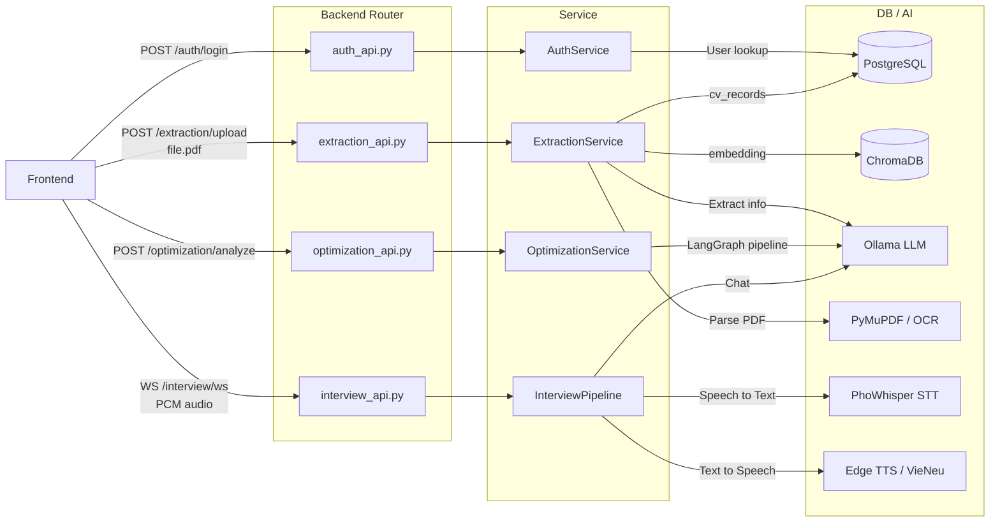

# LancerAI — System Overview

Tài liệu mô tả kiến trúc tổng thể của hệ thống, cách frontend và backend giao tiếp, và luồng xử lý của từng chức năng chính.

---

## Tổng quan

LancerAI gồm hai thành phần chạy độc lập:

- **Backend** (`app/`): API server Python / FastAPI — xử lý toàn bộ business logic: đọc CV, phân tích AI, phỏng vấn giọng nói.
- **Frontend** (`frontend/`): SPA viết bằng React + Vite — giao diện người dùng trên trình duyệt.

Frontend và backend giao tiếp qua REST API và WebSocket.

```
Trình duyệt (user)
    |
    | HTTP request / WebSocket
    v
Frontend — React + Vite (port 3000)
    |
    | fetch() / WebSocket
    v
Backend — FastAPI (port 8000)
    |
    |-- PostgreSQL  (lưu trữ user, CV, phiên phỏng vấn)
    |-- Redis       (hàng đợi tác vụ nền)
    |-- ChromaDB    (tìm kiếm ngữ nghĩa / vector)
    |-- Neo4j       (đồ thị kỹ năng)
    |-- Ollama      (LLM local)
```

---

## Cấu trúc thư mục gốc

```
lancerai/
├── app/               Backend FastAPI — toàn bộ business logic
├── frontend/          Frontend React + Vite — giao diện người dùng
├── docs/              Tài liệu kiến trúc (file này nằm ở đây)
├── migration/         Alembic — quản lý thay đổi schema database
├── tests/             Test tự động (pytest)
├── infra/             Cấu hình infrastructure (Docker, cloud)
├── docker-compose.yml Khởi động PostgreSQL, Redis, ChromaDB, Neo4j
├── pyproject.toml     Khai báo dependencies Python
├── .env.example       Mẫu biến môi trường
└── uv.lock            Lock file dependencies (uv package manager)
```

---

## Backend — Cách tổ chức code

Backend được chia theo 4 tầng rõ ràng, mỗi tầng có một nhiệm vụ duy nhất. Khi một request đến từ frontend, nó đi qua từng tầng theo thứ tự sau:

```
Request từ frontend
    |
    v
[1] router/          Tiếp nhận request, kiểm tra định dạng đầu vào
    |
    v
[2] service/         Xử lý logic nghiệp vụ (gọi AI, phân tích, tính toán)
    |
    v
[3] repository/      Đọc / ghi dữ liệu vào database
    |
    v
[4] models/          Định nghĩa cấu trúc bảng trong PostgreSQL
```

### Tầng 1 — `router/` (Điểm kết nối với frontend)

Mỗi file trong `router/v1/` tương ứng một nhóm chức năng, khai báo các địa chỉ URL (endpoints) mà frontend gọi tới.

```
router/
└── v1/
    ├── auth_api.py          /api/v1/auth/...      Đăng nhập, đăng ký
    ├── extraction_api.py    /api/v1/extraction/... Upload và đọc CV
    ├── optimization_api.py  /api/v1/optimization/. Phân tích và tối ưu CV
    ├── job_matching_api.py  /api/v1/jobs/...       So khớp CV với việc làm
    └── interview_api.py     /api/v1/interview/...  Phỏng vấn giọng nói
```

Router chỉ làm hai việc: (a) xác nhận dữ liệu đầu vào có đúng định dạng không, và (b) chuyển giao cho service tương ứng xử lý. Router không chứa bất kỳ logic tính toán nào.

**Ví dụ:** Khi người dùng upload CV, frontend gửi file đến `POST /api/v1/extraction/upload`. `extraction_api.py` nhận file, kiểm tra định dạng, rồi gọi `ExtractionService` để thực hiện việc đọc và phân tích.

### Tầng 2 — `service/` (Trung tâm xử lý)

`service/` chứa toàn bộ logic thực sự của ứng dụng. Đây là nơi AI được gọi, dữ liệu được phân tích, và kết quả được tổng hợp.

```
service/
├── auth_service.py          Xác thực người dùng
├── extraction_service.py    Đọc và cấu trúc hóa CV
├── optimization_service.py  Điều phối pipeline AI tối ưu CV
├── matching_service.py      Thuật toán so khớp CV với JD
├── interview_service.py     Quản lý vòng đời phiên phỏng vấn
├── agents/                  Các AI agent trong pipeline tối ưu CV
│   ├── graph.py             Định nghĩa luồng chạy của các agent (LangGraph)
│   ├── state.py             Dữ liệu chia sẻ giữa các agent
│   ├── retrieval_agent.py   Agent: thu thập ngữ cảnh ngành
│   ├── roast_agent.py       Agent: phát hiện điểm yếu trong CV
│   ├── rewrite_agent.py     Agent: viết lại các phần yếu
│   └── audit_agent.py       Agent: kiểm tra tính trung thực của bản viết lại
└── interview/               Pipeline phỏng vấn giọng nói real-time
    ├── pipeline.py          Quản lý một phiên phỏng vấn qua WebSocket
    ├── state.py             Trạng thái của phiên phỏng vấn
    └── agents.py            Các hàm AI: đặt câu hỏi, chấm điểm, tổng kết
```

### Tầng 3 — `repository/` (Truy cập dữ liệu)

`repository/` là lớp duy nhất được phép đọc ghi vào database. Service layer không bao giờ gọi SQL trực tiếp.

```
repository/
├── relational_repository.py  CRUD vào PostgreSQL (user, CV, session, job)
├── vector_repository.py      Lưu và tìm kiếm embedding vào ChromaDB
└── graph_repository.py       Truy vấn đồ thị kỹ năng trong Neo4j
```

### Tầng 4 — `models/` (Cấu trúc database)

`models/` định nghĩa các bảng dữ liệu trong PostgreSQL bằng SQLAlchemy ORM.

```
models/
├── user.py              Bảng users (tài khoản người dùng)
├── cv_record.py         Bảng cv_records (dữ liệu CV đã được đọc)
├── interview_session.py Bảng interview_sessions (kết quả phỏng vấn)
└── job_listing.py       Bảng job_listings (tin tuyển dụng đã crawl)
```

### Các thành phần hỗ trợ

```
core/
├── settings.py          Đọc toàn bộ config từ file .env
├── database.py          Kết nối đến PostgreSQL
├── dependencies.py      Wiring: kết nối các service, repo, connector lại với nhau
├── llm_connector.py     Giao tiếp với LLM (Ollama local hoặc Groq cloud)
├── voice_stt_connector  Nhận diện giọng nói (PhoWhisper)
├── voice_tts_connector  Chuyển văn bản thành giọng nói (Edge TTS / VieNeu)
├── ocr_processor.py     Đọc chữ từ ảnh (PaddleOCR)
├── security.py          Hash password, tạo và giải mã JWT token
├── logger.py            Logging với UTF-8 (hỗ trợ tiếng Việt)
└── lifespan.py          Khởi động và tắt ứng dụng (startup / shutdown hooks)

schema/
├── request.py           Định nghĩa dữ liệu đầu vào từ frontend (Pydantic)
└── response.py          Định nghĩa dữ liệu trả về cho frontend (Pydantic)

workers/
├── crawler_worker.py    Tác vụ nền: crawl tin tuyển dụng (Celery + Redis)
└── document_worker.py   Tác vụ nền: xuất CV ra PDF/DOCX (Celery + WeasyPrint)
```

---

## Frontend — Cách tổ chức code

Frontend được xây dựng bằng **React 18 + Vite 5**, chạy ở port 3000.

```
frontend/
├── src/
│   ├── pages/              Các trang chính
│   │   ├── LandingPage.jsx             Trang hiện ra đầu tiên khi người dùng truy cập lần đầu
│   │   ├── AuthPage.jsx                Đăng nhập / đăng ký
│   │   ├── AccountSettingsPage.jsx     Phần dropdown/quản lý tài khoản 
│   │   ├── AboutUsPage.jsx             Trang giới thiệu
│   │   ├── ProfilePage.jsx             Phần dropdown/thông tin cá nhân của người dùng
│   │   └── MainDashboard.jsx           Dashboard chính (sau khi đăng nhập)
│   ├── features/
│   │   └── ocr-cv/         Feature: upload và xem kết quả trích xuất CV
│   ├── components/
│   │   └── Layout/         Các component layout dùng chung
│   │   │   └── Navbar.jsx         Thanh điều hướng trong dashboard chính
│   ├── utils/
│   │   └── validation.js   Hàm validate dữ liệu form
│   ├── App.jsx             Định nghĩa routes (react-router-dom)
│   └── main.jsx            Entry point
├── public/                 Static assets
├── vite.config.js          Cấu hình Vite (port 3000, polling watch)
└── package.json            Dependencies: react 18, react-router-dom 6, vite 5
```

Frontend giao tiếp với backend qua `fetch()` (REST API) và `WebSocket` (phỏng vấn giọng nói). Địa chỉ backend được cấu hình qua biến môi trường.

---

## Các chức năng chính — Hoạt động từ đầu đến cuối

### 1. Đăng ký và Đăng nhập

**Frontend gửi:** `POST /api/v1/auth/signup` với email, password, display name.

**Backend xử lý:**
- `auth_api.py` nhận request, validate định dạng qua `AuthSignupRequest` schema.
- `AuthService.signup()` hash password bằng bcrypt, tạo bản ghi `User` trong PostgreSQL.
- Trả về thông tin user vừa tạo.

**Đăng nhập:** `POST /api/v1/auth/login` — backend kiểm tra password, ký một **JWT token** với thông tin user và trả về. Frontend lưu token này (localStorage hoặc cookie) và đính kèm vào header `Authorization: Bearer <token>` cho mọi request tiếp theo.

**Bảo vệ endpoint:** `core/dependencies.py` có hàm `get_current_user()` — FastAPI tự động gọi hàm này trước khi xử lý mọi endpoint yêu cầu đăng nhập. Nếu token không hợp lệ, backend trả về `HTTP 401` và request bị từ chối.

---

### 2. Upload và Kiểm tra CV

**Frontend gửi:** `POST /api/v1/extraction/upload` — multipart form với file CV (PDF hoặc ảnh) và ngôn ngữ (`vi` / `en`).

**Backend xử lý theo pipeline:**

```
File CV (PDF/ảnh)
    |
    v
[Bước 1] Trích xuất text
    - Nếu là PDF có text: dùng PyMuPDF để lấy text trực tiếp
    - Nếu là ảnh hoặc PDF scan: dùng PaddleOCR để nhận diện chữ
    |
    v
[Bước 2] Phân tích cấu trúc bằng LLM
    - Gửi raw text đến LLM (Ollama local hoặc Groq cloud)
    - LLM trả về JSON có cấu trúc: thông tin cá nhân, học vấn,
      kinh nghiệm, kỹ năng, chứng chỉ,...
    |
    v
[Bước 3] Lưu trữ
    - Lưu structured CV data vào bảng cv_records (PostgreSQL)
    - Tạo vector embedding và lưu vào ChromaDB (cho tìm kiếm sau)
    |
    v
Trả về: cv_id + toàn bộ CV đã được cấu trúc hóa
```

**Frontend nhận được:** `cv_id` — mã định danh CV. Mọi chức năng tiếp theo (tối ưu CV, so khớp việc làm, phỏng vấn) đều dùng `cv_id` này để tham chiếu đến CV của người dùng.

**Xem lại CV:** `GET /api/v1/extraction/cv/{cv_id}` — frontend gửi `cv_id`, backend tra cứu trong PostgreSQL và trả về dữ liệu đã phân tích.

---

### 3. Phân tích và Tối ưu hóa CV

**Frontend gửi:** `POST /api/v1/optimization/analyze` với `cv_id`, vị trí mục tiêu (`target_job_title`), ngành mục tiêu, và chế độ phân tích (`standard` hoặc `roast`).

**Backend chạy một pipeline nhiều AI agent (LangGraph):**

```
[Agent 1: retrieval_agent] Thu thập ngữ cảnh
  - Tìm kiếm trong ChromaDB: các JD tương tự, tiêu chuẩn ngành
  - Tổng hợp: kỹ năng bắt buộc, từ khóa ATS phổ biến cho vị trí này

[Agent 2: roast_agent] Phát hiện điểm yếu
  - Đọc CV với con mắt của recruiter
  - Gắn nhãn từng vấn đề: "vague_claim" (tuyên bố mơ hồ),
    "missing_metric" (thiếu số liệu), "weak_verb" (động từ yếu),
    "buzzword" (từ sáo rỗng),...

[Agent 3: rewrite_agent] Viết lại các phần yếu
  - Áp dụng công thức Google XYZ:
    "Accomplished X, as measured by Y, by doing Z"
  - Không được bịa ra số liệu — chỉ viết lại dựa trên thông tin gốc

[Agent 4: audit_agent] Kiểm duyệt
  - So sánh bản viết lại với CV gốc
  - Phán quyết từng phần: approved / needs_revision / rejected
  - Ghép các phần được duyệt vào bản CV tối ưu cuối cùng
```

**Frontend nhận được:** Báo cáo phân tích (danh sách vấn đề, giải thích) + CV đã được tối ưu.

**Xuất PDF:** `GET /api/v1/optimization/render_template_pdf?cv_id=...&template=harvard` — backend render CV tối ưu ra file PDF theo template được chọn (Harvard, Stanford, Modern) bằng WeasyPrint, trả về binary stream để frontend download.

---

### 4. So khớp CV với Việc làm

**Frontend gửi:** `POST /api/v1/jobs/match` với `cv_id` và job description (URL của tin tuyển dụng hoặc paste thẳng nội dung JD).

**Backend tính điểm bằng Hybrid Scoring:**

```
final_score = 0.20 x (frequency_score)   <- mức độ overlap từ khóa
            + 0.30 x (position_score)     <- từ khóa xuất hiện ở vị trí quan trọng
            + 0.50 x (semantic_score)     <- độ tương đồng ngữ nghĩa (vector + LLM)
```

**Frontend nhận được:** Điểm phù hợp tổng thể (0–100%), danh sách kỹ năng còn thiếu (`gap_list`) phân loại theo mức độ ảnh hưởng (critical / important / nice_to_have).

**Gợi ý việc làm:** `GET /api/v1/jobs/recommendations/{cv_id}` — backend tìm trong kho tin tuyển dụng đã crawl (bảng `job_listings`) những vị trí phù hợp nhất với CV thông qua vector similarity search.

---

### 5. Phỏng vấn Giọng nói (Real-time)

Đây là chức năng phức tạp nhất, sử dụng WebSocket để truyền dữ liệu audio liên tục hai chiều.

**Khởi tạo phiên:** Frontend gửi `POST /api/v1/interview/sessions` với `cv_id`, chế độ phỏng vấn (`practice` / `mock` / `quick`), thời lượng mong muốn. Backend tạo một bản ghi trong PostgreSQL, trả về `session_id`.

**Kết nối WebSocket:** Frontend mở `ws://localhost:8000/api/v1/interview/ws?token=<jwt>`. Từ đây, giao tiếp diễn ra real-time.

**Luồng audio trong một lượt hỏi-đáp:**

```
[Người dùng nói vào microphone]
    |
    | Chunk audio PCM Int16 mono @ 16kHz (raw bytes)
    v
Frontend gửi binary frames qua WebSocket
    |
    v
Backend — InterviewPipeline nhận audio
    |
    v
[Bước 1: Turn detection] Phát hiện khi người dùng dừng nói (silence gate)
    |
    v
[Bước 2: STT] PhoWhisper chuyển audio thành text (tiếng Việt)
    |
    v
[Bước 3: LLM] Gửi transcript vào LLM cùng với lịch sử hội thoại
  → LLM đóng vai interviewer, trả lời hoặc đặt câu hỏi tiếp theo
    |
    v
[Bước 4: TTS] Chuyển câu trả lời của AI thành giọng nói PCM @ 24kHz
    |
    v
Backend gửi audio bytes qua WebSocket về trình duyệt
    |
    v
[Loa phát ra giọng AI interviewer]
```

**Backend cũng gửi JSON events** xen kẽ với audio frames để frontend hiển thị trạng thái: transcript của người dùng, câu hỏi hiện tại, thời gian còn lại.

**Kết thúc phiên:** Frontend gửi `{"type": "end_session"}`. Backend chạy đánh giá STAR (Situation / Task / Action / Result) trên toàn bộ transcript, tính điểm từng câu trả lời, tổng hợp nhận xét, lưu vào `interview_sessions`.

**Xem kết quả:** `GET /api/v1/interview/sessions/{session_id}/report` — trả về báo cáo đầy đủ: điểm tổng thể, điểm STAR từng câu, danh sách vấn đề logic, gợi ý cải thiện.

---

## Tác vụ nền (Background Workers)

Một số công việc tốn thời gian không chạy trong request cycle mà được đẩy vào hàng đợi Celery (qua Redis) để chạy nền:

| Worker | Trigger | Chức năng |
|---|---|---|
| `crawler_worker.py` | Lịch hàng ngày | Tự động crawl tin tuyển dụng từ TopCV, ITviec |
| `document_worker.py` | Khi user xuất CV | Render PDF/DOCX theo template, trả về link download |

---

## Sơ đồ luồng dữ liệu tổng hợp



---

## Môi trường và Cấu hình

Cấu hình được đọc từ file `.env` (backend) và `.env` (frontend).

**Backend (`.env`):**

| Nhóm | Biến | Ý nghĩa |
|---|---|---|
| App | `APP_ENV`, `APP_DEBUG` | Môi trường chạy |
| Auth | `AUTH_SECRET_KEY` | Khóa ký JWT |
| Database | `DATABASE_URL` | Chuỗi kết nối PostgreSQL |
| Cache | `REDIS_URL` | Kết nối Redis (broker Celery) |
| LLM | `LLM_LOCAL_BASE_URL`, `LLM_LOCAL_MODEL` | Địa chỉ và tên model Ollama |
| LLM cloud | `LLM_CLOUD_API_KEY` | API key Groq (cloud fallback) |
| STT | `STT_MODEL_ID` | Model STT (mặc định: PhoWhisper-base) |
| TTS | `TTS_ENGINE`, `TTS_VOICE` | TTS engine (`edge` / `piper` / `vieneu`) |

**Frontend (`.env`):**

| Biến | Ý nghĩa |
|---|---|
| `VITE_API_BASE_URL` | Địa chỉ backend API (mặc định: `http://localhost:8000`) |

---

## Tài liệu liên quan

- [`docs/ARCHITECTURE.md`](ARCHITECTURE.md) — kiến trúc chi tiết, multi-tenancy, SaaS design
- [`app/README.md`](../app/README.md) — tổng quan backend package
- [`app/core/README.md`](../app/core/README.md) — infrastructure: settings, DI, connectors
- [`app/models/README.md`](../app/models/README.md) — database schema
- [`app/repository/README.md`](../app/repository/README.md) — data access layer
- [`app/router/README.md`](../app/router/README.md) — API endpoints
- [`app/service/README.md`](../app/service/README.md) — business logic services
- [`app/service/agents/README.md`](../app/service/agents/README.md) — LangGraph CV pipeline
- [`app/service/interview/README.md`](../app/service/interview/README.md) — voice interview pipeline
- [`app/workers/README.md`](../app/workers/README.md) — background tasks
- [`TODO.md`](../TODO.md) — danh sách công việc còn lại
